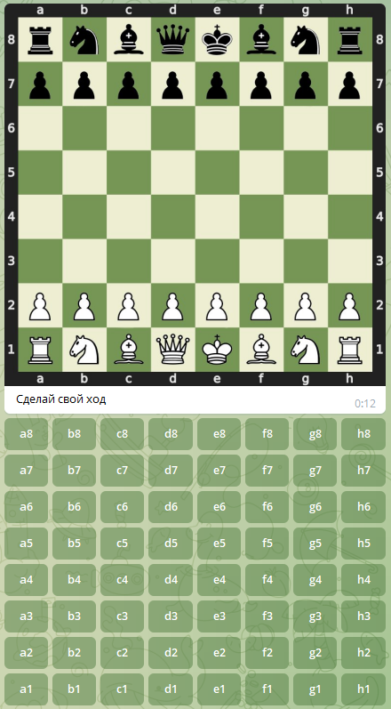

Пользовательская документация
===============================

-------------------------------
Хостинг бота
-------------------------------

* Бот может быть запущен только единожды в одной машине
* Для запуска модуля `python -m chessbot`
* Тесты отрабатывают при запуске `pytest` из корня

-------------------------------
Взаимодействие с ботом
-------------------------------

* Необходимо написать боту с ником `@PD22_chessbot`
* Для старта игры нужно отправить ему `/start`
* Игра закончится при победе\поражении или по команде `/stop`
* Завершить исполнение бота можно с помощью `/kill`

